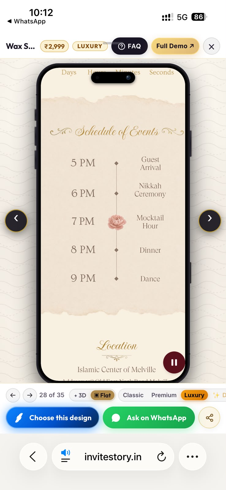
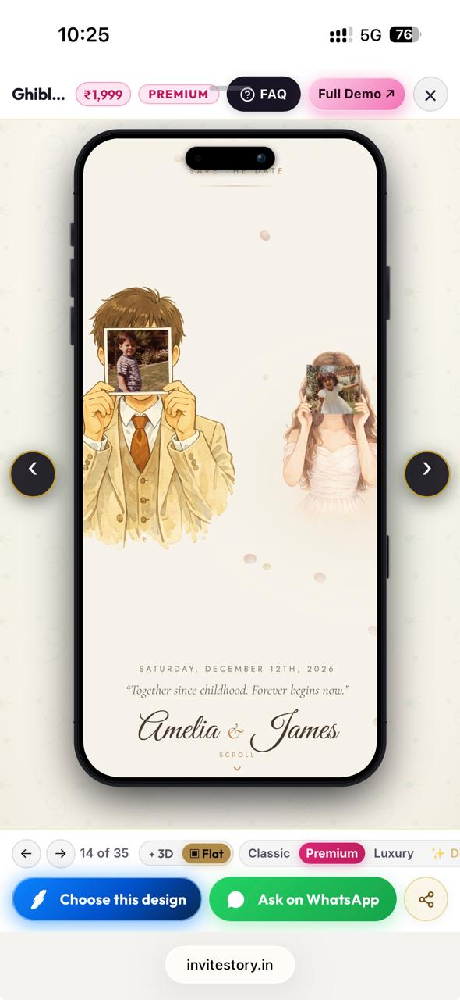

# Chat history export

- Exported (UTC): 2026-09-29T17:59:46.658Z
- Messages: 25 · media files: 2 · missing: 0
- Open `manifest.json` for the machine-readable file inventory (MIME, size, SHA-256, message links).
- Media paths below are relative: after unzipping, `media/…` opens next to this file, and `<audio>`/`<video>` tags preview inline.

## Conversation (chronological, UTC)

- **[29/09/26, 16:32] Dr D Das:** Hello .. i need a wedding invite
- **[29/09/26, 16:33] Dr D Das:** Can u guide me through?
- **[29/09/26, 16:53] Dr D Das:** Look at this "Ghibli Portrait" interactive wedding invitation ✨

It has custom music, animated couple story scenes, 1-tap Google Maps directions &amp; instant guest RSVP.

Check out the live preview here and tell me what you think: https://www.invitestory.in/?design=ghibli-portrait
- **[29/09/26, 16:53] Dr D Das:** Can we make this ?
- **[29/09/26, 16:54] Dr D Das** _(image, msg #13026)_:
  
  <!-- asset id=1702 msg=13026 mime=image/jpeg size=114754 sha256=2f3165c2e657878ec25e0854136d0a2ef4a34d4d51d91ebcfd404ec0d82ca7ec file=media/001-asset-1702.jpeg -->
- **[29/09/26, 16:55] Dr D Das:** Can you add this in it .. where we want to put the dates of all programs
- **[29/09/26, 16:55] Dr D Das:** No
- **[29/09/26, 16:56] Dr D Das** _(image, msg #13032)_:
  
  <!-- asset id=1703 msg=13032 mime=image/jpeg size=68153 sha256=9bff4694e0e0f696c901c387523e8183c67001d03e3f8a449ab41e35a9a76c5c file=media/002-asset-1703.jpeg -->
- **[29/09/26, 16:56] Dr D Das:** No
- **[29/09/26, 16:56] Dr D Das:** Yes
- **[29/09/26, 16:57] Dr D Das:** What will be the price and what all details do u need ?
- **[29/09/26, 16:57] Dr D Das:** Okk then please make one for me
- **[29/09/26, 16:58] Dr D Das:** ~~message deleted~~
- **[29/09/26, 16:58] Dr D Das:** ~~message deleted~~
- **[29/09/26, 17:00] Dr D Das:** 👰 Bride’s name: Diya Saha
🤵 Groom’s name: Debanu Das
📅 Wedding date &amp; time: 26 January 2027, 7:00 PM
📍 Venue: Manikya Enclave, Agartala,Tripura, 700094
- **[29/09/26, 17:01] Dr D Das:** https://maps.app.goo.gl/WpkDsBzRRQDXwznP8?g_st=iw
- **[29/09/26, 17:02] Dr D Das:** This one
- **[29/09/26, 17:02] Dr D Das:** Okk
- **[29/09/26, 17:02] Dr D Das:** Do u need our photos ?
- **[29/09/26, 17:03] Dr D Das:** And we need you to add other events as well
- **[29/09/26, 17:03] Dr D Das:** Let me share you the details
- **[29/09/26, 17:05] Dr D Das:** Yes we will but let me send you the details
- **[29/09/26, 17:06] Dr D Das:** Sent
- **[29/09/26, 17:10] Dr D Das:** 14/12/2026- Ashirbad ceremony timing-11am-5pm venue- Swarnabhumi banquet,Agartala,Tripura.
26/01/2027-Wedding timing-7pm onwards venue- The Manikya Enclave Agartala, Tripura
29/01/2027-Reception party
Timing-7pm onwards
Venue- Malancha Niwas , Agartala,Tripura
- **[29/09/26, 17:16] Dr D Das:** I will send the photos tomorrow
